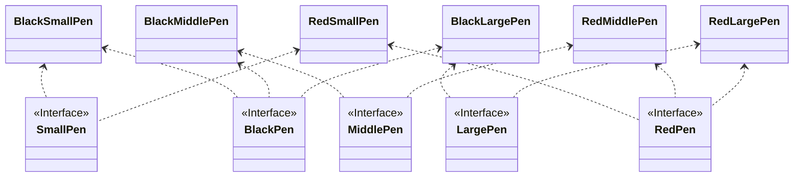
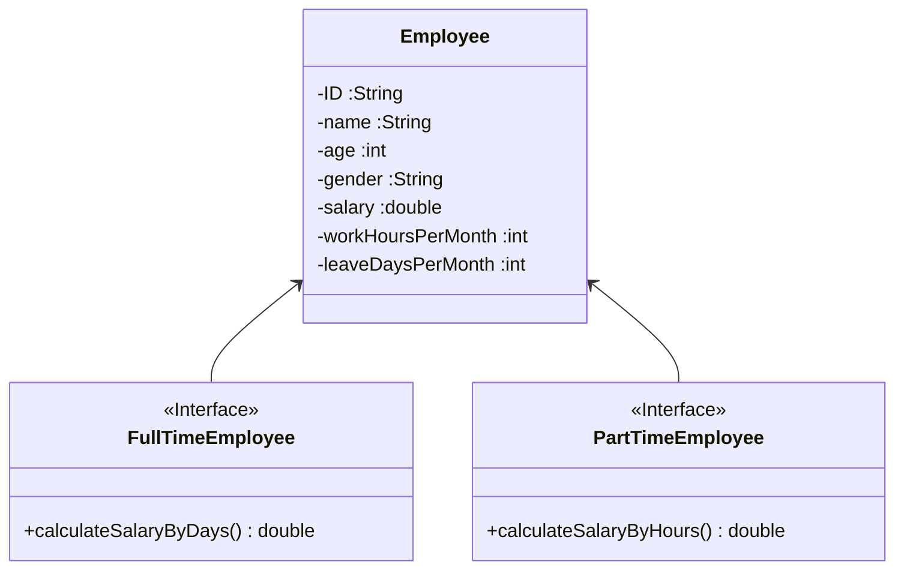
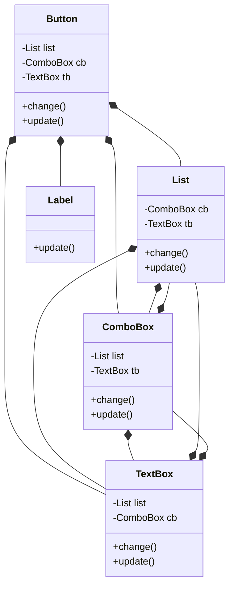
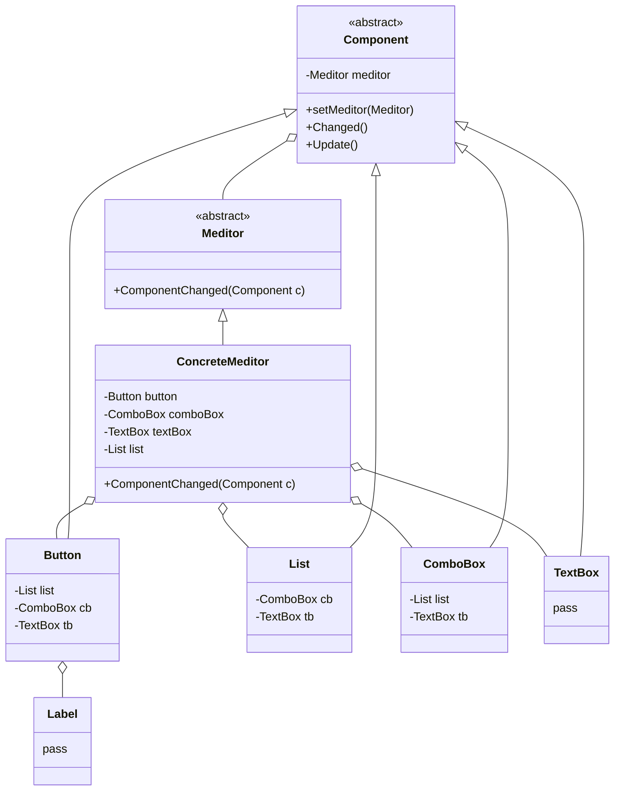
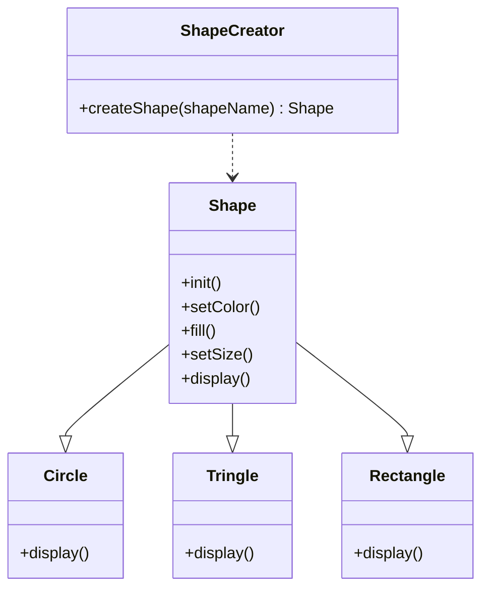

# DesignMode_Lab1

3020244350_张文浩

## 1 画笔

```mermaid
classDiagram

class SmallPen{
<<Interface>>
}

class MiddlePen{
<<Interface>>
}
class LargePen{
<<Interface>>
}

class RedPen{
<<Interface>>
}
class BlackPen{
<<Interface>>
}


BlackSmallPen <..SmallPen
BlackSmallPen <..BlackPen

BlackMiddlePen <..MiddlePen
BlackMiddlePen <..BlackPen

BlackLargePen <..LargePen
BlackLargePen <..BlackPen


RedSmallPen <..SmallPen
RedSmallPen <..RedPen

RedMiddlePen <..MiddlePen
RedMiddlePen <..RedPen

RedLargePen <..LargePen
RedLargePen <..RedPen
```

## 2 Employee

### 1 存在的问题

违反了单一职责原则

### 2 UML

```mermaid
classDiagram
class FullTimeEmployee{
<<Interface>>
+calculateSalaryByDays() double
}
class PartTimeEmployee{
<<Interface>>
+calculateSalaryByHours() double
}

class Employee{
-ID :String
-name :String
-age :int
-gender :String
-salary :double
-workHoursPerMonth :int
-leaveDaysPerMonth :int
}

Employee <-- FullTimeEmployee
Employee <-- PartTimeEmployee
```

## 3 组件

### 1 绘制UML

```mermaid
classDiagram
Button *-- List
Button *-- ComboBox
Button *-- TextBox
Button *-- Label

List *-- ComboBox
List *-- TextBox

ComboBox *--List
ComboBox *--TextBox

TextBox *--List
TextBox *--ComboBox

class Button{
-List list
-ComboBox cb
-TextBox tb
+change()
+update()
}

class List{
-ComboBox cb
-TextBox tb
+change()
+update()
}

class ComboBox{
-List list
-TextBox tb

+change()
+update()
}

class TextBox{
-List list
-ComboBox cb

+change()
+update()
}

class Label{
+update()
}
```

### 2 重构之后UML

```mermaid
classDiagram
Meditor <|-- ConcreteMeditor

ConcreteMeditor o--Button
ConcreteMeditor o--List
ConcreteMeditor o--ComboBox
ConcreteMeditor o--TextBox

Component o-- Meditor

Component <|--Button
Component <|--List
Component <|--ComboBox
Component <|--TextBox

Button o-- Label

class Button{
-List list
-ComboBox cb
-TextBox tb
}

class List{
-ComboBox cb
-TextBox tb
}

class ComboBox{
-List list
-TextBox tb
}

class TextBox{
pass
}

class Label{
pass
}

class Meditor{
<<abstract>>
+ComponentChanged(Component c)
}

class Component{
<<abstract>>
-Meditor meditor

+setMeditor(Meditor)
+Changed()
+Update()
}

class ConcreteMeditor{
-Button button
-ComboBox comboBox
-TextBox textBox
-List list

+ComponentChanged(Component c)
}
```

## 4 图形库

```mermaid
classDiagram

ShapeCreator ..> Shape
Shape --|> Circle
Shape --|> Tringle
Shape --|> Rectangle

class ShapeCreator{
+createShape(shapeName) Shape
}

class Shape{
+init()
+setColor()
+fill()
+setSize()
+display()
}

class Circle{
+display()
}

class Tringle{
+display()
}

class Rectangle{
+display()
}
```

