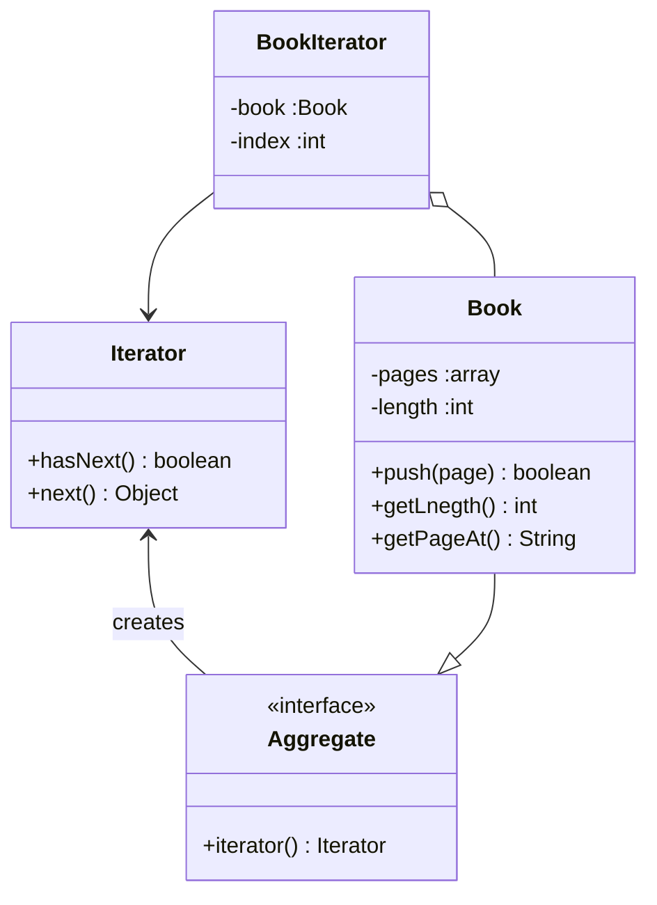
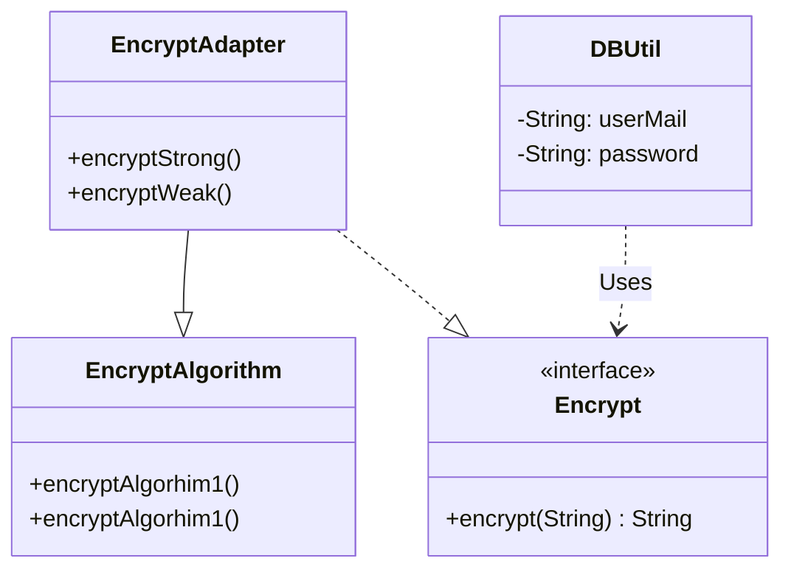
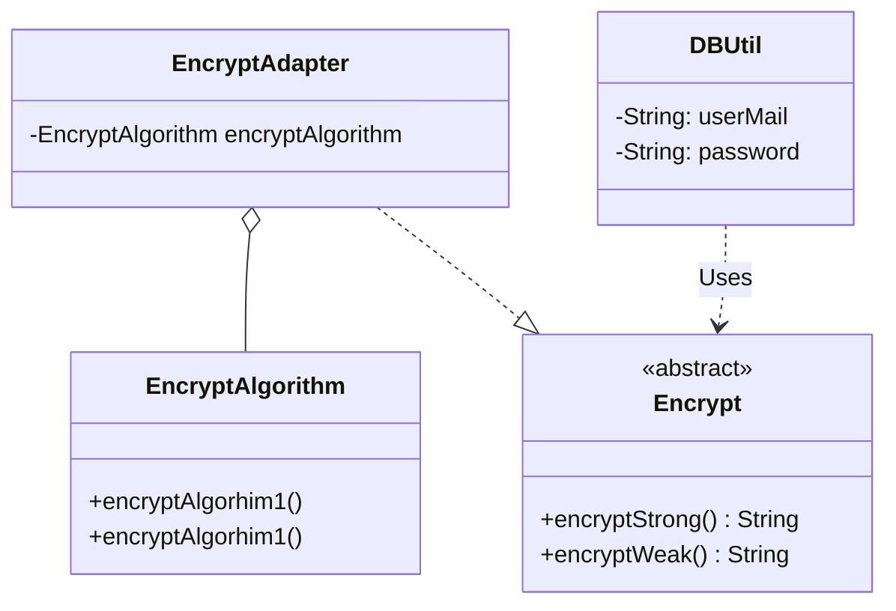
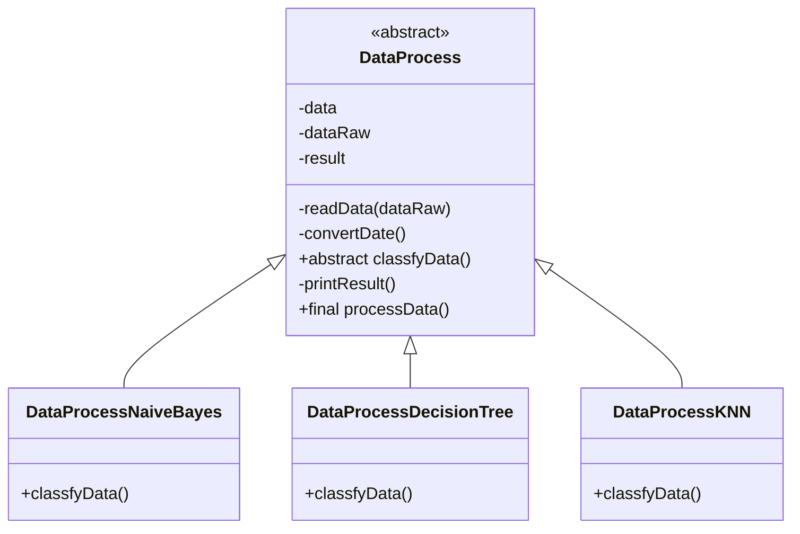

# DesignMode_Lab2

3020244350_张文浩

## 一、实验目的

1. 结合实例，熟练绘制设计模式结构图。
2. 结合实例，熟练使用Java语言实现设计模式。
3. 通过本实验，理解每一种设计模式的模式动机，掌握模式结构，学习如何使用代码实现
   这些设计模式。

## 二、实验要求

1. 结合实例，绘制设计模式的结构图。
2. 使用Java语言实现设计模式实例，代码运行正确。

## 三、实验内容

### 1.迭代器模式

设计一个逐页迭代器，每次可返回指定个数（一页）元素，并将该迭代器用于对数据进行分页处理。绘制对应的类图并编程模拟实现。

### 2.适配器模式

某OA系统需要提供一个加密模块，将用户机密信息（例如口令、邮箱等）加密之后再存储在数据库中，系统已经定义好了数据库操作类。为了提高开发效率，现需要重用已有的加密算法，这些算法封装在一些由第三方提供的类中，有些甚至没有源代码。试使用适配器模式设计该加密模块，实现在不修改现有类的基础上重用第三方加密方法。要求绘制相应的类图并编程模拟实现，需要提供对象适配器和类适配器两套实现方案。

#### 1.类适配器

#### 2.对象适配器

### 3.模板方式模式和适配器模式

在某数据挖掘工具的数据分类模块中，数据处理流程包括4个步骤，分别是：①读取数据；②转换数据格式；③调用数据分类算法；④显示数据分类结果。对于不同的分类算法而言，第①步、第②步和第④步是相同的，主要区别在于第③步。第③步将调用算法库中已有的分类算法实现，例如朴素贝叶斯分类（NaiveBayes）算法、决策树（DecisionTree）算法、K最近邻（K-NearestNeighbor,KNN）算法等。现采用模板方法模式和适配器模式设计该数据分类模块，绘制对应的类图并编程模拟实现。

### 4.工厂方法模式

在某网络管理软件中，需要为不同的网络协议提供不同的连接类，例如针对POP3协议的连接类POP3Connection、针对IMAP协议的连接类IMAPConnection、针对HTTP协议的连接类HTTPConnection等。由于网络连接对象的创建过程较为复杂，需要将其创建过程封装到专门的类中，该软件还将支持更多类型的网络协议。现采用工厂方法模式进行设计，绘制类图并编程模拟实现。

### 5.单例模式

某Web性能测试软件中包含一个虚拟用户生成器（VirtualUserGenerator）。为了避免生成的虚拟用户数量不一致，该测试软件在工作时只允许启动唯一一个虚拟用户生成器。采用单例模式设计该虚拟用户生成器，绘制类图并分别使用饿汉式单例、双重检测锁和IoDH三种方式编程模拟实现。

### 6.原型模式

在某在线招聘网站中，用户可以创建一个简历模板。针对不同的工作岗位，可以复制该简历模板并进行适当修改后，生成一份新的简历。在复制简历时，用户可以选择是否复制简历中的照片：如果选择“是”，则照片将一同被复制，用户对新简历中的照片进行修改不会影响到简历模板中的照片，对模板进行修改也不会影响到新简历；如果选择“否”，则直接引用简历模板中的照片，修改简历模板中的照片将导致新简历中的照片一同修改，反之亦然。现采用原型模式设计该简历复制功能并提供浅克隆和深克隆两套实现方案，绘制对应的类图并编程模拟实现。

## 四、实验结果

需要提供设计模式实例的结构图（类图）和实现代码。

## 五、实验小结

请总结本次实验的体会，包括学会了什么、遇到哪些问题、如何解决这些问题以及存在哪些有待改进的地方。